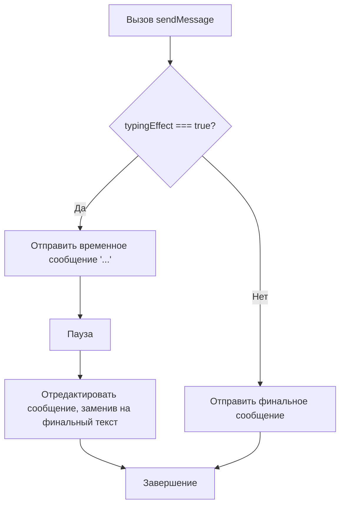

# Проектирование "Эффекта печатания" в TelegramService

## 1. Введение

Этот документ описывает предлагаемые изменения для добавления "эффекта печатания" в `TelegramService`. Цель — улучшить пользовательский опыт, имитируя набор текста перед отправкой финального сообщения.

## 2. Требования

-   Реализовать возможность отправки временного сообщения ("...") с последующим обновлением до финального текста.
-   Сделать эту функцию опциональной через параметр в методе `sendMessage`.
-   Сохранить всю логику взаимодействия с Telegram API внутри `TelegramService`.

## 3. Предлагаемые изменения

### 3.1. Модификация интерфейса `SendMessageOptions`

Чтобы управлять "эффектом печатания", мы добавим новый опциональный флаг `typingEffect` в интерфейс `SendMessageOptions`.

**Файл:** `src/screen/interfaces/screen.interface.ts`

```typescript
export interface SendMessageOptions {
  removeKeyboard?: boolean;
  keyboard?: any;
  typingEffect?: boolean; // Новое свойство
}
```

### 3.2. Обновление метода `sendMessage`

Метод `sendMessage` в `TelegramService` будет изменен для поддержки нового флага.

**Файл:** `src/telegram/telegram.service.ts`

**Текущая реализация:**
```typescript
async sendMessage(
  ctx: AppContext,
  message: string,
  options: SendMessageOptions = {},
): Promise<void> {
  try {
    await ctx.reply(message, options.keyboard);
  } catch (error) {
    this.logger.error('Error sending message:', error);
    throw new HttpException(
      'Failed to send message',
      HttpStatus.INTERNAL_SERVER_ERROR,
    );
  }
}
```

**Новая реализация:**
```typescript
async sendMessage(
  ctx: AppContext,
  message: string,
  options: SendMessageOptions = {},
): Promise<void> {
  try {
    if (options.typingEffect) {
      // 1. Отправляем временное сообщение
      const typingMessage = await ctx.reply('...', options.keyboard);

      // 2. Устанавливаем небольшую задержку
      await new Promise(resolve => setTimeout(resolve, 1000)); // 1 секунда

      // 3. Редактируем сообщение, заменяя его на финальный текст
      await ctx.telegram.editMessageText(
        ctx.chat.id,
        typingMessage.message_id,
        undefined,
        message,
        {
          reply_markup: options.keyboard?.reply_markup,
        },
      );
    } else {
      await ctx.reply(message, options.keyboard);
    }
  } catch (error) {
    this.logger.error('Error sending message:', error);
    throw new HttpException(
      'Failed to send message',
      HttpStatus.INTERNAL_SERVER_ERROR,
    );
  }
}
```

## 4. Логика работы

Диаграмма ниже иллюстрирует логику работы обновленного метода `sendMessage`.



## 5. Как использовать

Для активации "эффекта печатания" достаточно передать `{ typingEffect: true }` в `options` при вызове `sendMessage`.

**Пример:**
```typescript
// Где-то в коде экрана (Screen)
// ...
await telegramService.sendMessage(ctx, 'Ваш финальный текст сообщения.', { typingEffect: true });
// ...
```

Это завершает проектирование. Следующим шагом будет реализация этих изменений в коде.